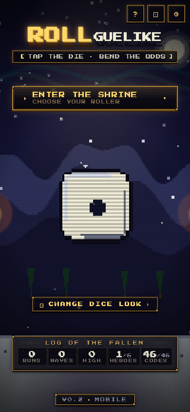
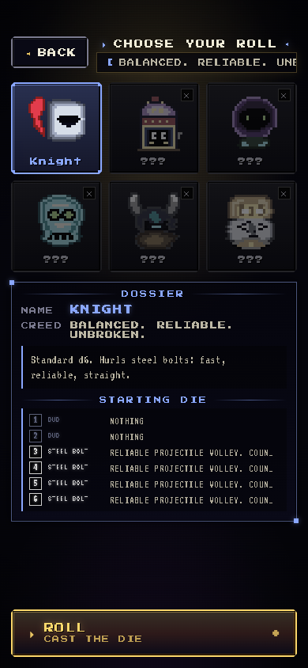
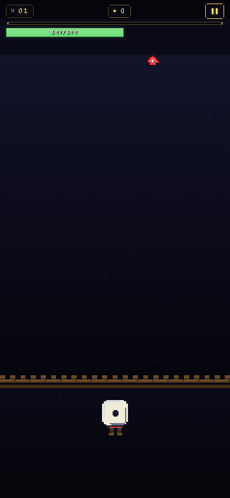

# ROLLguelike

**Tap the die. Survive the waves. Stack ridiculous upgrades.**

ROLLguelike is a **mobile-first browser roguelite**: enemies fall from the top, you stay anchored at the bottom, and every roll fires an auto-aimed attack based on the face you land on. Clear a wave, pick an upgrade (rerolls are free), repeat until the wall breaks or you do.

Pixel UI, crunchy SFX, and endless scaling difficulty — built to play in a phone browser without installing anything.

---

## See it in action

Portrait layout: **shrine → choose your chalice → arena.**

| Shrine | Chalice hall | The arena |
|:---:|:---:|:---:|
|  |  |  |
| Meta stats, **New run**, and the glowing die inviting you in. | Six heroes (one unlock); each has their own die identity and playstyle. | Wave counter, score, streak — tap to roll and let attacks find their targets. |

**UI highlights**

- **Die altar** on the title — live pixel die, shrine lighting, torch embers.
- **Character select** — grid of chalices, readable dossier, color-coded identity per hero.
- **In-run HUD** — minimal top strip; arena stays readable during chaos.
- **Upgrade picker** — card layout with rarity, stacking rules, and instant reroll (no tax on curiosity).
- **Boss cadence** — every 5th wave is a boss; beat it for **two** upgrade picks.

---

## The loop (one thumb)

1. **Roll** — Tap the die (or hold, for Clockmaker). Faces are attacks: bolts, smashes, heals, shields, elements, souls — depending on who you picked.
2. **Clear** — Auto-targeting keeps focus on play; you’re managing cadence and risk, not a virtual joystick.
3. **Choose** — After each wave, draft an upgrade. Build toward multishot, reactions, extra dice, turrets, or pure survivability.
4. **Scale** — Difficulty and variety climb; reactions and arsenal shots reward elemental planning.

---

## Heroes (chalices)

Each run is built around **one** character — same core loop, very different dice math.

| Hero | Unlock | What it feels like |
|------|--------|--------------------|
| **Soldier** | Starter | Reliable d6 all-rounder. |
| **Gambler** | Starter | Blank faces swing huge; blanks can shield you. |
| **Alchemist** | Starter | Every face carries **element** tags — combine for big **reaction** bursts. |
| **Necromancer** | Starter | Kills feed **souls**; soul faces cash in for heavy hits. |
| **Berserker** | Starter | Faster rolls, **rage** on kills, faces that scale with momentum. |
| **Clockmaker** | Finish **3 runs** | **Hold to charge** rolls; enemies slow near your wall. |

---

## Upgrades — build variety

Drafts pull from a wide pool: you’re not just “+damage” — you’re assembling **synergies**.

| Track | What you’re signing up for | Examples |
|--------|----------------------------|----------|
| **Dice** | More dice, biased rolls, face rewrites | *Second Die*, *Third Die*, *Loaded: Six*, *Wild Face*, *Cascade* |
| **Projectile** | On-hit behavior and scaling | *Piercing*, *Ricochet*, *Chain*, *Homing*, *Split Shot*, *Executioner* |
| **Passive** | Sustain and mitigation | *Vitality*, *Regeneration*, *Iron Skin*, *Bloodlust*, *Resolve* |
| **AoE** | Screen-wide rhythm and payoff | *Death Nova*, *Shockwave Hit*, *Orbital Strike*, *Finale* |
| **Landmark** | Map furniture that fights or heals | *Side Turret*, *Healing Beacon*, *Reflective Wall*, *Time Keeper* |
| **Arsenal** | Element-flavored **alternate shots** | *Firebolt [Thermal]*, *Frost Shard [Cryo]*, *Void Bolt [Void]*, *Prismatic Beam [Prism]* — mix with Alchemist for fireworks |

Rarities gate power spikes; stacks and `maxStack` keep things from exploding — until you find the combo that does it on purpose.

---

## Sound & feel

**Procedural chiptune-style BGM**, **jsfxr-style SFX**, and light **haptics** on supported devices — tuned so the game reads as “arcade cabinet in your pocket,” not a muted web demo.

---

## Play locally

```bash
npm install
npm run dev
```

Open the URL Vite prints. The game expects **portrait**; landscape on phones shows a rotate hint.

```bash
npm run build && npm run preview   # production-shaped build
```

---

## For developers

Implementation details, folder layout, hook system, content authoring, and screenshot automation: **[TECH.md](./TECH.md)**  
Product scope and pillars: **[rollguelike-prd.md](./rollguelike-prd.md)**

## License

MIT
