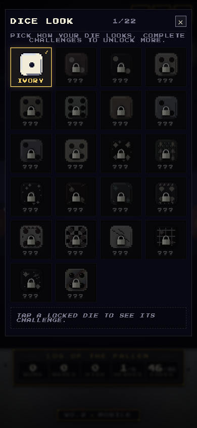

# ROLLguelike

**Tap the die. Forge your faces. Survive the waves.**

ROLLguelike is a **mobile-first browser roguelite**: enemies fall from the top, you stay anchored at the bottom, and every roll resolves a **die face** — bolts, bursts, heals, shields, reactions, and wild effects — auto-aimed based on what you slotted on your d6. Clear a wave, hit the **forge**, spend **gold** to grow your build, repeat until the wall breaks or you do.

Pixel UI, procedural **menu backdrops** (a fresh theme when you return to the title), crunchy SFX, and **unlockable die skins** — built to play in a phone browser without installing anything.

---

## See it in action

After each normal wave: **forge** (faces, gold, free rerolls). On **boss** waves: draft **landmarks** (map furniture) for two picks, then the run continues. Title screen: **Log of the Fallen** stats, **face codex** progress, and **Change dice look**.

| Main menu | Chalice hall | The arena |
|:---:|:---:|:---:|
|  |  |  |
| Rotating **menu theme**; meta stats, **New run** / **Enter the shrine**; **Codex** tile. | **Choose your roll** — six heroes; sealed heroes show unlock rules. | Wave, score, gold; **face bar** shows the six slotted attacks; tap to roll. |

| Die themes |
|:---:|
|  |
| **DICE LOOK** — pick a visual theme; **locked** swatches show the challenge to earn them. |

**UI highlights**

- **Themed main menu** — canvas backdrop (sky temple, vault, cove, …) re-rolls when you re-enter; die altar, flavor ticker, v2 layout.
- **Character select** — chalice grid, portrait frame, per-hero identity and **Roll** / **Sealed** flow.
- **In-run** — face bar + HUD strip; **forge** with drag–drop face offers, rare expensive **relics**, sell, optional skip-for-heal.
- **Landmarks & relics** (boss waves) — card draft with rarity; two picks on a boss clear when the pool is available.
- **Settings** — audio, haptics, motion, **accessibility** (contrast, large text, reduce motion, damage numbers, HP bar mode, auto-roll, …).

---

## The loop (one thumb)

1. **Roll** — Tap the die (or hold, for **Clockmaker**). Each result fires the **face** slotted in that position — multishot, elements, turrets, novas, depending on your forge choices.
2. **Clear** — Auto-targeting keeps focus on play; you’re reading patterns and economy, not aiming.
3. **Forge** (most waves) — Spend **gold** on offers: replace a face, buy rare global **relics**, tier up face chains, rearrange slots, or sell. **Rerolls are free.**
4. **Boss interlude** — On boss waves, pick **landmarks** or mythic **relics** with **two** selections when the draft fires; then the next wave starts.
5. **Meta** — **Die themes** unlock from in-run challenges; pick them on the title screen. **Runs**, **waves**, **high score**, **heroes**, and **codex** progress save in the browser.

---

## Heroes (chalices)

Each run is built around **one** character — same core loop, different starting faces and passives.

| Hero | Unlock | What it feels like |
|------|--------|--------------------|
| **Soldier** | Starter | Solid **d6** baseline; room to **forge** into anything. |
| **Gambler** | Starter | **Blank** faces and big tempo swings. |
| **Alchemist** | Starter | **Element** tags; combine for **reaction** bursts. |
| **Necromancer** | Starter | Kills → **souls**; soul faces pay off. |
| **Berserker** | Starter | Momentum, **rage**, and faster cadence. |
| **Clockmaker** | Finish **3 runs** | **Hold to charge** rolls; time-bend fantasy. |

---

## Builds — faces, gold, and landmarks

You’re not shopping abstract “+damage” rows anymore — you’re **composing a die**:

| Layer | What it is | Examples / notes |
|--------|------------|------------------|
| **Face replacers** | Replace default pips with named attacks, heals, or utilities | Shots, novas, **lances**, familiars, **transmute**, … |
| **Relics** | Rare global passives that reshape the whole run | Excalibur, Holy Grail, Mjolnir, Necronomicon — expensive and highly visible |
| **Gold** | Dropped in combat and from wave clear; spent in the **forge** | Price scales with **tier** and **rarity**; sell/trade off bad rolls |
| **Landmarks** | **Boss** draft pool — map furniture on your side of the wall | Turrets, beacons, time tricks — `maxStack` and unlock rules apply |
| **Meta** (title) | Stats, **codex** coverage, **dice look** | Saved locally; challenges unlock **die themes** |

Rarity still gates spikes; the **codex** on the title screen tracks how many face upgrades you’ve seen.

---

## Sound & feel

**Procedural** menu BGM (genre-rotates per menu visit) plus **layered** gameplay music, **jsfxr-style SFX**, and light **haptics** on supported devices — tuned for “arcade cab in your pocket,” not a muted web demo.

---

## Play locally

```bash
npm install
npm run dev
```

Open the URL Vite prints. The game expects **portrait**; landscape on phones shows a rotate hint.

```bash
npm run build && npm run preview   # production-shaped build
```

### Refresh README screenshots

With the dev server on **`http://127.0.0.1:5173`** (and Chromium installed for Playwright):

```bash
npx playwright install chromium   # first time only
npm run screenshot:readme
```

Writes `docs/screenshots/{menu,dice-look,character-select,gameplay}.png`. Override: `README_SHOT_URL=… npm run screenshot:readme`

---

## For developers

Implementation details, folder layout, hook system, and content authoring: **[TECH.md](./TECH.md)**  
Product scope and pillars: **[rollguelike-prd.md](./rollguelike-prd.md)** (may lag the shipped **dice/forge** model in places).

## License

MIT
